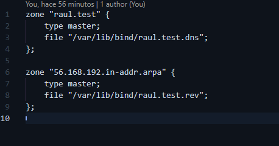
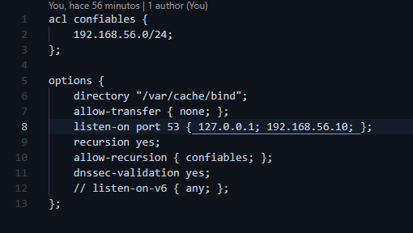
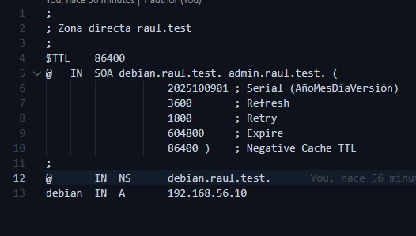
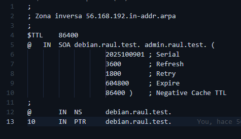
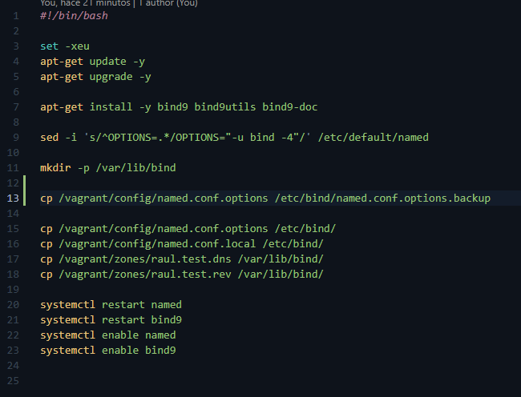
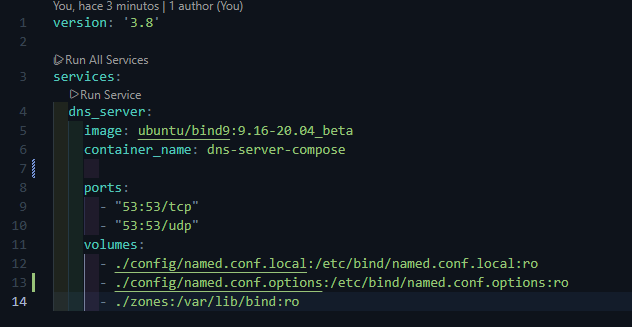
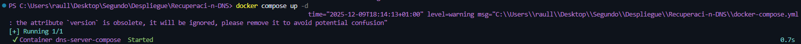
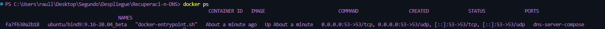
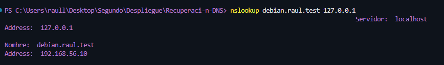

# DNS-Recuperacion

Este es mi segundo repositorio, ya que en el primero no se han subido las cosas, al final del readme te dejo la captura de pantalla con los commits.

# Recuperación-DNS
En este repositorio voy a subir el trabajo de recuperación de DNS de Raúl Labrador Pérez

## 1. Preparación de los archivos DNS
Como te comenté por correo, esta práctica la corregí cuando la vimos en clase, para entenderla mejor y dejarla lista para la futura recuperación además de usar una variante para la práctica de FTP.

Por tanto para esta práctica me he pasado los archivos pertinentes. 
 - config/named.conf.options

 - config/named.conf.local

 - zones/raul.test.dns

 - zones/raul.test.rev

 - bootstrap.sh

## 2. Montaje en Docker
Primero he realizado un pull, de la imagen proporcionada para crear el contenedor.
He creado un archivo docker-compose.yml para montar el contenedor. 
Aqui le decimos que dentro de servicios tendrá un servicio llamado dns_server, le pasamos la imagen que vamos a usar, le damos un nombre al contenedor y le decimos que este funcionando hasta que el yo lo detenga.

Luego le mapeamos los puertos, para asegurarnos de que el DNS va a funcionar de manera correcta. 
Y le pasamos los archivos necesarios, en mi caso le voy a pasar el archivo de configuración llamado `named.conf.local` y `named.conf.options`, además de la carpeta `zones` que contiene los archivos `raul.test.dns` y `raul.test.rev`.

Ahora que ya tengo el composer configurado, solo tenemos que ejectuar el comando `docker-compose up -d` y ver el resultado.

## 3. Comprobación 
Vemos que el contenedor está ejecutadp y corriendo de manera correcta.

Y ahora al hacer el ping con nslookup, podemos ver que nos devuelve la IP correcta y el nombre correcto.

Fernando, he tenido un problema y es que no se me han ido subiendo los commits que he ido haciendo del trabajo, en el repositorio solo sale uno pero tengo varios:
